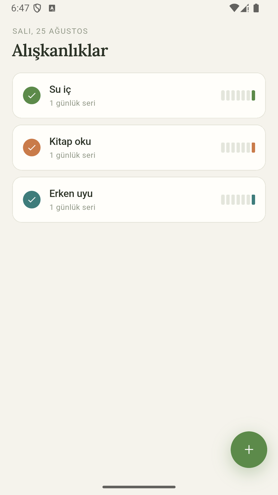
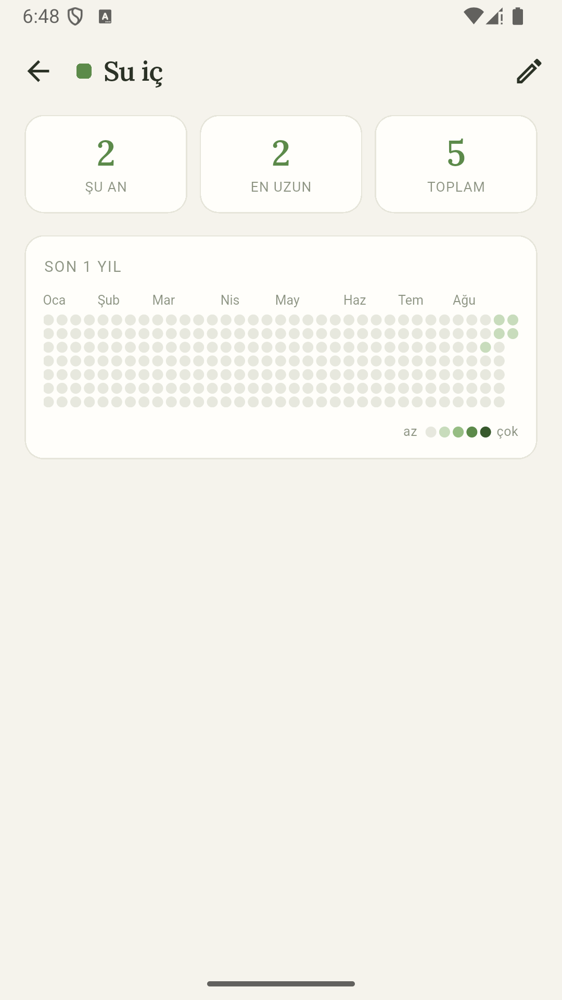

# Alışkanlık Takipçisi
### Part 01 · Her Hafta 1 Uygulama

Alışkanlık edinmeye çalışan biri için, "kaç gündür üst üste yapıyorum?"
sorusunu tek bakışta cevaplayan bir Android uygulaması.

**Kod:** `<!-- ADIM 3'te repo linki -->` · **Süre:** 48 saat · **Yığın:** Flutter, Drift, path_provider

---

## 01 — Ne yaptım

Alışkanlık ekliyorsun, günü işaretliyorsun, ısı haritasında serini görüyorsun.
Geçmiş bir günü unuttuysan haritadan o güne dokunup sonradan ekleyebiliyorsun.
Üç ekran, tamamen çevrimdışı, hesap yok.

---

## 02 — 48 saatte neyi YAPMADIM

- Bildirim / hatırlatıcı
- Haftalık hedef ("haftada 3 gün")
- Kategori ve etiket
- İstatistik grafikleri
- Bulut senkronizasyonu, hesap sistemi
- Ana ekran widget'ı
- Açık/koyu tema seçici
- Veri dışa aktarma

Bunları zaman yetmediği için değil, **kapsamı Cumartesi sabahı dondurduğum
için** yapmadım. Sekiz maddenin her biri tek başına bir hafta sonu eder. Biri
girseydi çekirdek akış yarım kalırdı; yarım kalan uygulamanın portföy değeri
sıfırdır.

---

## 03 — Bu hafta gösterdiğim teknik yetenek

**Yerel veritabanı (Drift) + `CustomPainter` ile elle çizim.**

Isı haritası bir yıllık veriyi gösteriyor — 371 hücre. Bunu her hücre için bir
widget üreterek (`GridView` içinde 371 `Container`) çizmek mümkün, ama Flutter
o kadar widget'ı ayrı ayrı yerleştirip boyar ve kaydırma takılmaya başlar.
`CustomPainter` ile tüm ızgara tek bir tuval üzerine, tek geçişte çizilir.

`CustomPainter`, Flutter'da doğrudan çizim yapmanı sağlayan sınıf — widget
ağacına dokunmadan piksel seviyesinde çalışıyorsun.

→ [lib/ui/widgets/heatmap_view.dart](lib/ui/widgets/heatmap_view.dart)

Izgara matematiğini çizimden ayırdım, böylece test edilebilir kaldı:
→ [lib/domain/heatmap_grid.dart](lib/domain/heatmap_grid.dart)

---

## 04 — Aldığım karar

**Neden Hive değil Drift?**

Bu boyutta bir uygulamada akla ilk gelen yerel depolama genelde Hive olur:
kurulumu daha hızlı, kod üretimi gerektirmiyor. Ben Drift'i seçtim.

Sebep şu: "mevcut seri" ve "en uzun seri" aslında bir **tarih aralığı
sorgusu**. Hive bir anahtar-değer deposu — tarih aralığı diye bir kavramı yok.
Sorguyu çalıştırmak için tüm kayıtları belleğe çekip Dart tarafında filtrelemem
gerekirdi. Drift, SQLite üzerine tip güvenli bir katman; aynı iş tek SQL
sorgusu.

Bugün 20 kayıtla fark yok. Kullanıcı iki yıl boyunca beş alışkanlık işaretlerse
3.600 kayıt oluyor ve fark orada açılıyor. Kurulum maliyetini bir kez ödeyip
doğru veri modeliyle başlamayı tercih ettim.

**İkinci karar:** Riverpod/Provider kullanmadım. Üç ekranlık bir uygulamada
Flutter'ın kendi `StreamBuilder` ve `ValueNotifier` araçları yetiyor. Riverpod
serinin başka bir haftasının konusu — aynı yeteneği iki kez göstermiyorum.

---

## 05 — Nasıl doğruladım

25 birim testi yazdım, hepsi saf mantık katmanında: seri hesabı, ısı haritası
ızgara yerleşimi, tarih dönüşümleri.

Widget testi **yazmadım.** 48 saate sığmazdı, ama asıl sebep şu: riskin olduğu
yer arayüz değil, tarih matematiğiydi. Ay ve yıl sınırlarını geçen seriler için
ayrı regresyon testleri var.

---

## 06 — Ne öğrendim

Tarihleri `DateTime` yerine `yyyymmdd` biçiminde `int` olarak sakladım. Saat
dilimi ve yaz saati kaymalarının gün karşılaştırmalarını bozmasını baştan
kesiyor — sonradan yaşayıp düzeltmek yerine baştan kurmak çok daha ucuz.

Dart'ın `toUpperCase()` metodu Türkçe 'i' harfini noktasız 'I' yapıyor —
"Cumartesi" başlıkta "CUMARTESI" çıkıyor, "CUMARTESİ" değil. Elle düzeltmek
gerekti. Yerelleştirme, dili çevirmekten ibaret değilmiş.

---

Bu, her hafta sonu bir mobil uygulama bitirdiğim serinin 1. uygulaması.
Diğerleri: `<!-- ADIM 3'te seri repo linki -->`
