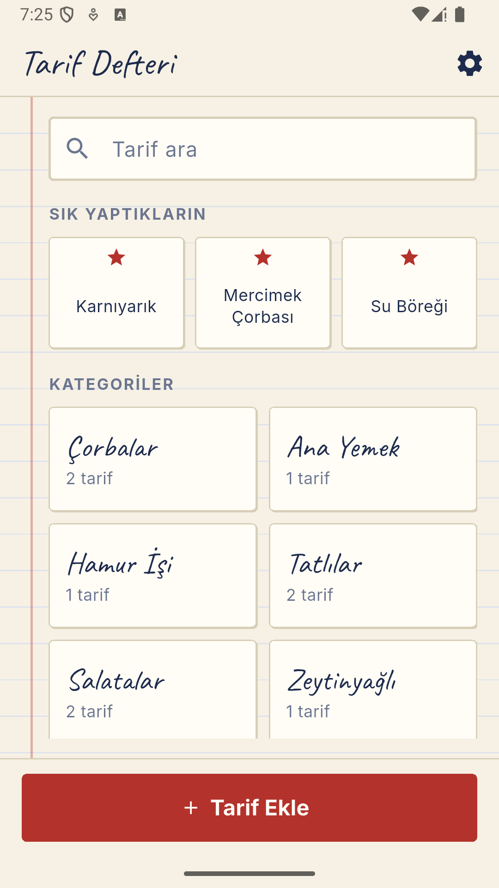
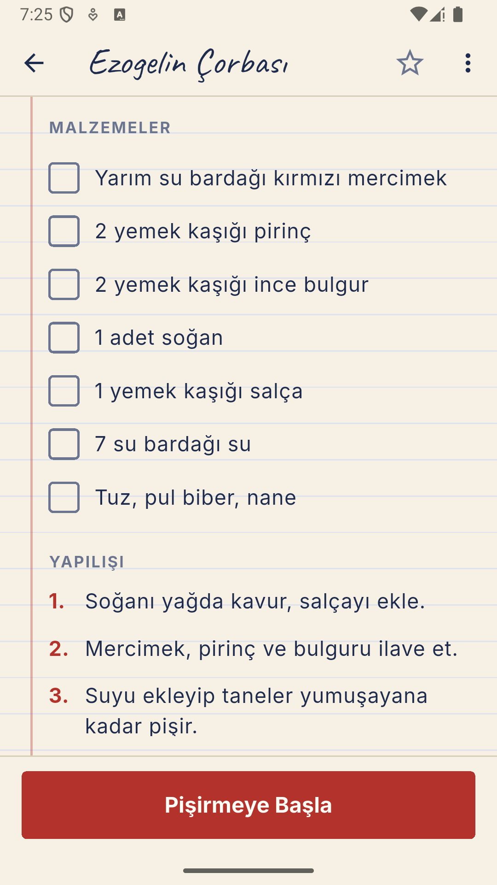
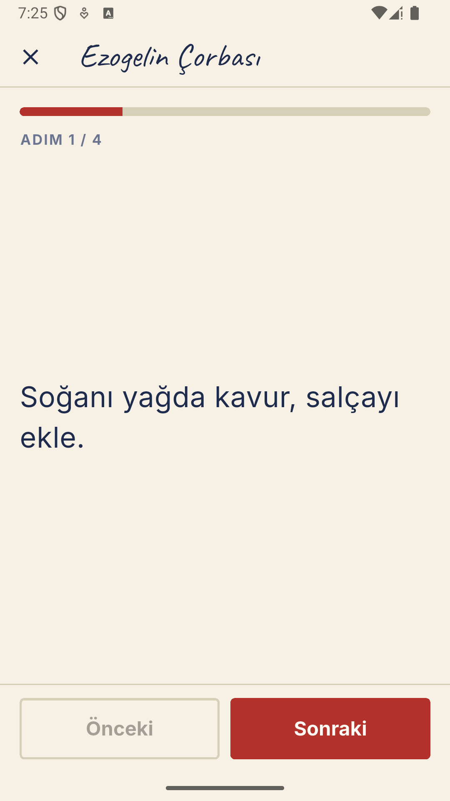

# Tarif Defteri — Her Hafta 1 Uygulama, Part 02

Annemin el yazısı tarif defterini telefona taşıyan, tamamen çevrimdışı çalışan
bir Flutter uygulaması. Tek bir kişinin, tek bir telefonda kullanması için
yapıldı: hesap yok, sunucu yok, internet yok.

Her hafta bir uygulamanın baştan sona bitirildiği bir serinin ikinci halkası.
Serinin tamamı:
[weekly-flutter-apps-1](https://github.com/MRGNSs11/weekly-flutter-apps-1).

| Ana ekran | Tarif okuma | Adım adım pişirme |
|---|---|---|
|  |  |  |

## Çekirdek akış

Kategoriyi seç veya ara → tarifi aç → malzemeleri tikle → adım adım pişir.

## Depoda tarif yok

Bu uygulamanın en önemli kararı kod mimarisinde değil, deponun içeriğinde:
**annemin tarifleri buraya hiç girmiyor.**

```
depo (public)                             telefon
├─ lib/                    kod           ├─ uygulama veritabanı
├─ assets/demo_recipes.json  uydurma  ←──┤ ilk açılışta yüklenir
└─ assets/recipes.json     .gitignore ───┘ (yalnızca benim derlememde)
```

Uygulama açılışta önce `assets/recipes.json` dosyasına bakar, yoksa
`assets/demo_recipes.json` dosyasını yükler. Kod ikisini de aynı şekilde okur;
gizlilik kod akışıyla değil, **hangi dosyanın depoya girdiğiyle** sağlanıyor.
Buradaki ekran görüntüleri de uydurma demo tariflerle çekildi.

Dosya adı `pubspec.yaml`'da tek tek yazılsaydı, dosya yokken derleme hata
verirdi. Bu yüzden `assets/` klasörünün tamamı veriliyor: var olan ne varsa
paketleniyor, olmayan sorun çıkarmıyor.

## Türkçe arama — `toLowerCase()` neden yetmiyor?

Annem "çorba" yazmak zorunda kalmamalı; "corba" da aynı sonucu vermeli. Bunun
için tarif adı ve malzemeler sadeleştirilmiş bir metin sütununda saklanıyor ve
arama orada yapılıyor.

Dart'ın hazır metotları bu işi tek başına yapamıyor, çünkü ikisi de Türkçe'de
yanlış sonuç veriyor:

| Girdi | Dart | Doğrusu |
|---|---|---|
| `'I'.toLowerCase()` | `'i'` | `'ı'` |
| `'İ'.toLowerCase()` | `'i'` + U+0307 (iki kod birimi) | `'i'` |
| `'tarifin'.toUpperCase()` | `'TARIFIN'` | `'TARİFİN'` |

İkinci satır sinsi olanı: sonuç ekranda "i" gibi görünür ama arkasında görünmez
bir birleşen nokta taşır, bu yüzden `'i'` ile karşılaştırıldığında eşleşmez.
Arama çalışıyor görünür, bazı tarifler hiç bulunamaz.

Çözüm, harfleri `toLowerCase()` çağrılmadan **önce** elle eşlemek. Üçüncü satır
aynı hatanın tersi ve arayüzde görünen hali — düzeltilmeden önce ekranda
"TARIFIN ADI" yazıyordu. İkisi de teste bağlı:
[`test/domain/turkish_text_test.dart`](test/domain/turkish_text_test.dart).

## Yaşlı kullanıcı için verilen kararlar

- **El yazısı font yalnızca başlıklarda.** Tarif adında güzel duruyor, üç
  satırlık pişirme talimatında okunmuyor. Uzun metnin tamamı gövde fontuyla.
- **Tarif açıkken ekran kapanmıyor** (`wakelock_plus`). Elleri hamurluyken
  ekrana dokunup uyandırmak gerekmesin.
- **Silme iki aşamalı:** onay penceresi, ardından geri alınabilir bildirim.
  Yanlış düğmeye basmak kolay ve bu tariflerin başka bir kopyası yok.
- **Kategori silinince tarifleri silinmiyor**, "Kategorisiz" başlığı altında
  görünmeye devam ediyorlar.
- **Yazı boyutu ayarı telefonun sistem ayarını yok sayıyor.** Sistem yazısı
  küçük olabilir; tarif okurken büyük olması gerekiyor.

## Neden X değil Y?

**Malzemeler neden ayrı tabloda değil?** Malzemeler yalnızca kendi tarifiyle
birlikte okunuyor, tek başına sorgulanmıyor ve sıralı bir liste. Ayrı tablo her
tarif açılışında bir birleştirme ve bir sıra sütunu getirir, karşılığında hiçbir
şey kazandırmazdı. Tek metin sütunu + `TypeConverter` yeterli.

**Neden FTS5 değil?** Defterde birkaç yüz tarif var. Sadeleştirilmiş sütun
üzerinde `LIKE` bu boyutta anında sonuç veriyor; tam metin arama indeksi
kurmanın karşılığı yok.

**Neden Riverpod/Provider yok?** Paylaşılan şey iki nesne (depo ve ayarlar) ve
altı ekran. `InheritedWidget` bu iş için yetiyor, ek paket ve ek kavram
getirmiyor.

**Neden `google_fonts` yok?** O paket fontu çalışma anında internetten indirir.
Bu uygulama çevrimdışı; fontlar `assets/fonts/` altında pakete gömülü.

**Neden `shared_preferences` yok?** Zaten bir veritabanı var. İkinci bir saklama
yeri, ikinci bir yedekleme sorunu demek. Tema ve yazı boyutu aynı veritabanında.

## Yedekleme

Ayarlardan alınan yedek, tariflerin tamamını okunabilir tek bir JSON dosyasına
yazıp paylaşım penceresini açıyor. Anahtarlar Türkçe (`ad`, `malzemeler`,
`adimlar`), çünkü bu dosyayı elle yazan bir insan var — tarifleri defterden ben
geçiriyorum. Malzemeler hem dizi hem satır satır tek metin olarak kabul ediliyor.

## Kullanılan paketler

`drift` + `drift_flutter` (yerel veritabanı) · `path_provider` ·
`wakelock_plus` (ekranı açık tutma) · `share_plus` (yedeği dışa aktarma)

## Çalıştırmak için

```bash
flutter pub get
dart run build_runner build     # Drift kod üretimi
flutter run
```

Uygulama, depodaki uydurma demo tariflerle açılır.

## Testler

```bash
flutter test
```

34 test: Türkçe metin dönüşümleri, yedek dosyasının okunup yazılması, arama,
silme/geri alma, ilk yükleme davranışı.

## Bu sürümde bilerek olmayanlar

Fotoğraf · bulut yedekleme ve senkronizasyon · hesap · tarif paylaşma ·
alışveriş listesi · mutfak zamanlayıcısı · porsiyon hesaplama · iOS.

## Lisans

MIT — [LICENSE](LICENSE).
Fontlar (Caveat, Inter) SIL Open Font License ile dağıtılır.
