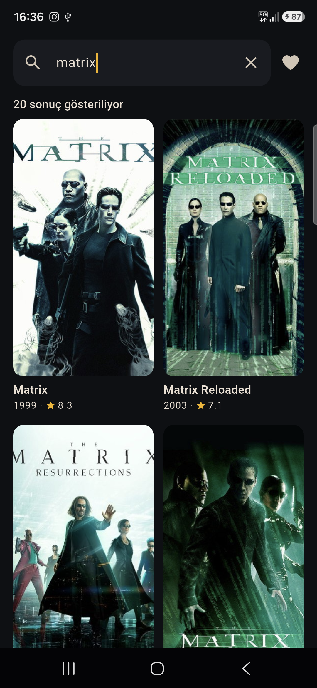
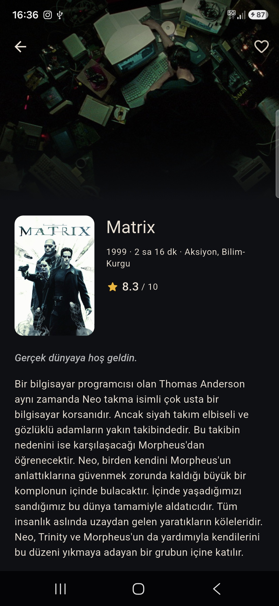

# Part 03 — Film Arama

TMDB üzerinden film arayan, yazarken anında sonuç gösteren Flutter uygulaması.
"Her hafta 1 uygulama" serisinin üçüncü parçası.

**Gösterilen yetenek:** ağ katmanı — debounce'lu arama, önceki isteğin iptali,
sayfalama, yükleniyor/hata/boş durumlarının ayrı ayrı ele alınması.

## Çalıştırma

Uygulama kendi TMDB anahtarınla çalışır. Anahtar depoda yoktur ve olmayacaktır.

1. [themoviedb.org](https://www.themoviedb.org) → üye ol → **Settings → API** →
   **API Key (v3 auth)** kopyala.
2. Çalıştır:

```bash
flutter pub get
flutter run --dart-define=TMDB_KEY=senin_anahtarin
```

Kolaylık için `calistir.ps1.ornek` dosyasını `calistir.ps1` adıyla kopyalayıp
anahtarını içine yazabilirsin; o dosya `.gitignore`'dadır.

Anahtarsız çalıştırırsan uygulama çökmez, ne yapman gerektiğini yazan bir hata
gösterir.

## Neden `.env` değil `--dart-define`?

`flutter_dotenv` iki şey yapar: diske bir `.env` dosyası koyar ve onu APK'ya
varlık olarak gömer. Birincisi yanlışlıkla commit'lenebilir, ikincisi zaten
açılabilir bir dosyadır. `--dart-define` hiç dosya oluşturmaz; değer derleme
zamanında `String.fromEnvironment` ile okunur.

Dürüst sınır: bu yöntem anahtarı **depodan** gizler, **derlenmiş APK'dan**
gizlemez — sabit metin ikilinin içinde durur. Gerçek bir üründe anahtar kendi
sunucunun arkasında dururdu ve istemci ona hiç sahip olmazdı. Bu uygulama APK
olarak dağıtılmıyor, kaynaktan çalıştırılıyor.

Anahtarın sızarsa TMDB panelinden tek tıkla yenileyebilirsin.

## Güvenlik önlemleri

| Önlem | Nerede |
|---|---|
| Anahtar hiçbir dosyada yazılı değil | `lib/core/tmdb_config.dart` |
| Şifresiz (http) istek baştan reddedilir | `HttpsGuardInterceptor` |
| Günlüklerde anahtar yıldızlanır | `RedactingLogInterceptor` |
| Commit öncesi sır taraması | depo kökü `.githooks/pre-commit` + `.gitleaks.toml` |
| Veri toplama yok | analytics/crash SDK'sı yok, favoriler sadece cihazda |
| Cihaz yedeği kapalı | `allowBackup` + `fullBackupContent` + `dataExtractionRules` |

"Favoriler cihazda kalıyor" cümlesi ilk yazıldığında **doğru değildi**:
Android varsayılan olarak uygulama verisini kullanıcının Google hesabına
yedekler ve bunu kapatan bir şey yoktu. Üç satır birlikte kapatıyor — biri
yetmiyor, çünkü Android 12'den itibaren cihazdan cihaza aktarım ayrı bir yol
ve onu yalnızca `dataExtractionRules` kapatıyor.

Bedeli küçük: telefon değişince birkaç film id'si kaybolur, kullanıcı yeniden
kalbe basar. Doğrulama:

```bash
flutter build apk --release
grep -oE 'uses-permission android:name="[^"]*"|android:allowBackup="[^"]*"' \
  build/app/intermediates/merged_manifest/release/processReleaseMainManifest/AndroidManifest.xml
# → allowBackup="false", tek gerçek izin INTERNET
```

## Ekranlar

| Ekran | Ne yapar |
|---|---|
| Arama | Poster ızgarası; kutu boşken popüler filmler, yazınca arama sonuçları |
| Künye | Poster, yıl, süre, tür, puan, özet; favoriye ekleme |
| Favoriler | Kaydedilen filmler, tamamen cihazda |




## Doğrulama

```bash
flutter analyze   # temiz
flutter test      # 37 test
```

Testlerde ağ yok: `test/fake_movie_repository.dart` gerçek TMDB'nin yerine
geçiyor, gecikme ve hata üretebiliyor. Debounce'un tek istek bıraktığı,
iptal edilen cevabın yeni sonuçların üstüne yazmadığı ve sayfa hatasının
listeyi silmediği böyle ölçülüyor.

## Paketler

`dio` · `flutter_riverpod` · `cached_network_image` · `shared_preferences`

`cached_network_image` bilerek 3.x'te tutuldu: 4.0 sürümü bu projedeki
Flutter sürümünden daha yeni bir `meta` paketi istiyor.

## Kurulum notu

Depoyu klonladıysan commit koruması için bir kez:

```bash
git config core.hooksPath .githooks
```
