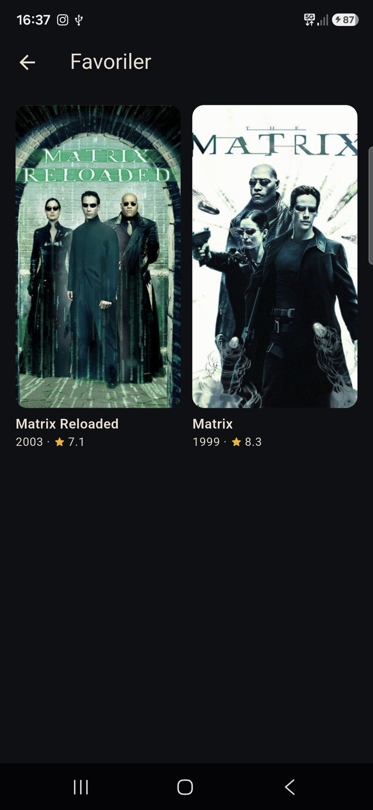

# Film Arama
### Part 03 · Her Hafta 1 Uygulama

Film aramak isteyen kullanıcı için, yazarken anında sonuç görme ve filmin
künyesine ulaşma problemini çözen bir Android uygulaması. Veriyi TMDB'den
çekiyor.

**Kod:** [github.com/MRGNSs11/weekly-flutter-apps-1](https://github.com/MRGNSs11/weekly-flutter-apps-1/tree/main/part03-film-arama) · **Yığın:** Flutter, dio, Riverpod, cached_network_image

---

## 01 — Ne yaptım

Arama kutusuna yazıyorsun, yazmayı bırakmandan kısa süre sonra poster ızgarası
doluyor. Bir postere dokununca künye açılıyor: yıl, süre, tür, puan, özet.
Beğendiğin filmi kalple kaydediyorsun, favoriler telefonda kalıyor.

Kutu boşken popüler filmler duruyor, yani ekran hiçbir zaman bomboş değil.
Aşağı kaydırdıkça sonraki sayfalar ekleniyor.

---

## 02 — Neyi YAPMADIM

- Filtre ve sıralama (tür, yıl, puan)
- Oyuncu kadrosu, fragman, benzer filmler
- Çevrimdışı veritabanı
- Kullanıcı girişi, TMDB hesabı, oy verme
- iOS

Bu haftanın konusu ağ katmanıydı. Yukarıdakilerin hepsi "bir ekran daha"
demek; hiçbiri bu haftaki yeteneğe yeni bir şey katmıyordu. Çevrimdışı
veritabanını özellikle eledim, çünkü Part 01 ve Part 02 zaten veritabanı
gösteriyor.

---

## 03 — Bu hafta gösterdiğim teknik yetenek

Ağ katmanı. Dört parçası var ve hepsi tek sınıfta toplandı —
[lib/state/movie_feed.dart](lib/state/movie_feed.dart):

**Debounce:** her tuş vuruşu istek atmıyor, yazmayı bıraktıktan 400 ms sonra
tek istek gidiyor. **İstek iptali:** yeni arama başladığında önceki istek
`CancelToken` ile kesiliyor — dio'nun "bu isteği unut" düğmesi. **Sayfalama:**
liste dibine iki ekran kala sonraki sayfa isteniyor, gelen filmler id'ye göre
tekrar elenip ekleniyor. **Durumlar:** yükleniyor, hata, boş sonuç ve "sayfa
hatası" birbirinden ayrı; sonuncusunda mevcut liste ekranda kalıyor, sadece
altta uyarı çıkıyor.

Ağ hataları arayüze `DioException` olarak ulaşmıyor. Hepsi
[lib/core/tmdb_exception.dart](lib/core/tmdb_exception.dart) içinde dokuz
türe ve dokuz Türkçe cümleye çevriliyor.

---

## 04 — Aldığım karar

**Neden `.env` değil `--dart-define`?**

Public bir depoda API anahtarı tutmanın standart cevabı `flutter_dotenv`.
Onu seçseydim depoda bir `.env` dosyası olacaktı: yanlışlıkla commit'lenmeye
açık ve APK'nın içine varlık olarak gömülen bir dosya. Onun yerine anahtarı
derleme zamanında verdim —
[lib/core/tmdb_config.dart](lib/core/tmdb_config.dart) içinde
`String.fromEnvironment`. Diskte hiç dosya oluşmuyor, bir paket de eksiliyor.

Fark şurada açılıyor: `.env` yaklaşımında anahtarı sızdırmak için yanlış bir
`git add` yetiyor. `--dart-define`'da sızdıracak dosya yok.

Ama bu yöntem anahtarı **depodan** gizler, **derlenmiş APK'dan** gizlemez —
sabit metin ikilinin içinde durur. Bunu gizleyen tek şey kendi sunucun
olurdu. Bu uygulama APK olarak dağıtılmıyor, o yüzden sınırda durdum ve
sınırı README'ye yazdım.

---

## 05 — Nasıl doğruladım

37 test. Debounce gerçekten tek istek bırakıyor mu, iptal edilen istek
sonuçların üstüne yazıyor mu, sayfa hatası listeyi siliyor mu — hepsi sahte
bir depo üzerinden ölçüldü, testlerde ağ yok. Üç widget testi ekranın
yükleniyor/hata/boş durumlarını doğruluyor.

Poster indirmeyi test etmedim: orada benim kodum yok, `cached_network_image`
var. Asıl risk zamanlamada ve durum yönetimindeydi.

---

## 06 — Ne öğrendim

Riverpod 3'te `valueOrNull` kalkmış, `value` zaten null dönüyor — sürüm notu
okumadan yazmaya başlayınca on dakika kaybettim. Bir de `Uri`, sorgu
değerindeki yıldızı `%2A` diye kodluyor; günlükte anahtarı yıldızla
gizlemeye çalışırken çıktı okunmaz hâle geldi, maskeyi düz sözcüğe çevirdim.

---
Bu, her hafta bir mobil uygulama bitirdiğim serinin 3. uygulaması.
Diğerleri: [github.com/MRGNSs11/weekly-flutter-apps-1](https://github.com/MRGNSs11/weekly-flutter-apps-1)
