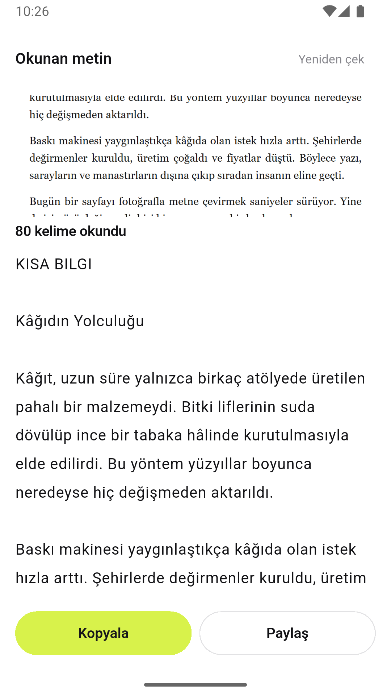
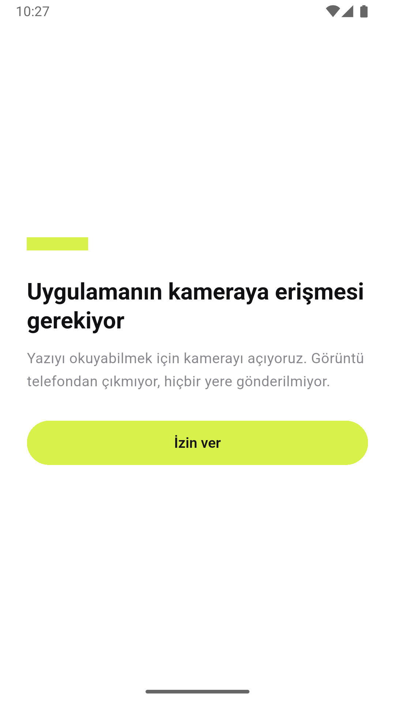

# Metin Tarayıcı
### Part 04 · Her Hafta 1 Uygulama

Kâğıttaki yazıyı telefona geçirmek isteyen kullanıcı için, elle yeniden yazma
problemini çözen bir Android uygulaması. Metin tanıma cihazda çalışıyor:
release derlemesinin tek izni `CAMERA`, internet izni yok.

**Kod:** [github.com/MRGNSs11/weekly-flutter-apps-1](https://github.com/MRGNSs11/weekly-flutter-apps-1/tree/main/part04-metin-tarayici) · **Yığın:** Flutter, camera, Google ML Kit (on-device), share_plus




---

## 01 — Ne yaptım

Kamerayı yazıya tutuyorsun, nişangah kadrajı gösteriyor, deklanşöre basıyorsun.
Bir sonraki ekranda çektiğin kare üstte duruyor, altında okunan metin var:
kaç kelime okunduğu yazıyor, metnin kendisi düzenlenebilir bir alanda.
Kopyala veya Paylaş.

Kamera yerine galerideki bir fotoğrafı da verebiliyorsun; ML Kit için ikisi de
sadece bir dosya yolu.

---

## 02 — Neyi YAPMADIM

- **Canlı akışta anlık tanıma** (çekmeden, kamera görüntüsü üstünde)
- Metin bloklarının üstüne çerçeve çizme
- Geçmiş, kayıt, veritabanı
- Çeviri, dil algılama, el yazısı
- Belge kenarı bulma, perspektif düzeltme, PDF
- iOS

Canlı akış en cazip olanıydı ve bilerek elendi. `CameraImage` karesini ML Kit'in
beklediği biçime çevirmek — YUV düzlemleri, cihaz yönü, ön/arka kamera farkı —
bu işin bilinen batağı. Tek kare çekmek ise `takePicture()` +
`InputImage.fromFilePath()`, iki satır. Haftayı kare dönüşümüne harcayıp
gösterilecek yeteneği hiç göstermeden bitirmek olurdu.

---

## 03 — Bu hafta gösterdiğim teknik yetenek

**Kamera + cihazda çalışan makine öğrenmesi.** Seride ilk kez donanıma
dokunuyorum ve ilk kez bir model çalıştırıyorum.

Kamera tarafında asıl iş yaşam döngüsü: uygulama arka plana atılınca kontrolcü
bırakılıyor (başka uygulama kamerayı kullanabilsin, geri dönünce donuk kare
kalmasın), öne gelince izin yeniden okunup kamera tekrar açılıyor —
[lib/ui/screens/camera_screen.dart](lib/ui/screens/camera_screen.dart).

İzin tarafında iki ayrı hâl var: "şimdi olmaz" ve "bir daha sorma". İkincisinde
sistem diyaloğu artık hiç açılmıyor; uygulama tekrar sorarsa hiçbir şey olmaz ve
kullanıcı siyah ekrana bakar. Ayrım
[lib/camera/camera_permission.dart](lib/camera/camera_permission.dart) içinde
üç değerli bir enum'a indiriliyor, kalıcı redde tek çıkış olarak "Ayarları aç"
düğmesi çıkıyor.

ML Kit çağrısının kendisi üç satır. Asıl kod **modelden sonra** başlıyor:
ham çıktı doğrudan gösterilemez. Bloklar sayfadaki sıraya göre gelmez,
paragraflar satır satır kırıktır, satır sonundaki tire kelimeyi ikiye böler.
Bunu düzelten katman [lib/ocr/okunan_metin.dart](lib/ocr/okunan_metin.dart).

---

## 04 — Aldığım karar

**Neden bulut OCR değil cihazda OCR?**

Geçen hafta (Part 03) API anahtarını depodan nasıl uzak tuttuğumu yazmıştım ve
şöyle bitmişti: anahtarı depodan gizleyebiliyorum, derlenmiş APK'dan
gizleyemiyorum. Bu hafta hiç anahtar kullanmadım.

Google Cloud Vision veya AWS Textract daha iyi okur — bunu kabul ediyorum.
Karşılığında üç şey gelirdi: saklanması gereken bir anahtar, bir kota/faturalama
ilişkisi, ve **kullanıcının fotoğrafının bir sunucuya gitmesi.** Üçüncüsü bu
uygulama için tuhaf olurdu; insanlar bu uygulamaya faturasını, reçetesini,
kimliğini tutacak.

ML Kit'in Latin metin modeli APK'nın içinde çalışıyor. Bedelini ölçtüm:
**+27 MB.** Tahmin değil — paketi eklemeden önce ve ekledikten sonra debug APK
alıp farkı aldım (147 → 174 MB). 27 MB, "şu fotoğraf telefondan hiç çıkmadı"
cümlesinin fiyatı.

Sonra bu cümleyi kanıtlamaya çalıştım ve hafta asıl burada ilginçleşti.

Kendi manifest'ime tek satır izin yazmıştım: `CAMERA`. Ama uygulamanın
gerçekten istediği izinler o dosyada değil, **birleşmiş** manifest'te. Ona
bakınca beş izin daha çıktı. Dördü kameraydı ve anlaşılırdı: `camera` eklentisi
video da kaydedebildiği için `RECORD_AUDIO` ve depolama izinleri getiriyor —
biz `enableAudio: false` ile tek kare alıyoruz, hiçbiri gerekmiyor.

Beşincisi `INTERNET`'ti. Kaynağı ML Kit değil, ML Kit'in bağımlısı olan
`com.google.android.datatransport`: Google'ın telemetri kütüphanesi. Yani model
gerçekten cihazda çalışıyordu, ama paket yanında "kullanım verisini bize
gönderebileyim" diye bir ağ izni getiriyordu. Tam da kaçındığım şeyin küçük
bir kopyası.

Beşini de `tools:node="remove"` ile çıkardım —
[android/app/src/main/AndroidManifest.xml](android/app/src/main/AndroidManifest.xml).
Release derlemesinin birleşmiş manifest'inde artık sadece `CAMERA` var; komut
README'de yazıyor, okuyan kendi kontrol edebilir.

Aynı gözle diske de baktım ve ikinci bir açık çıktı: `takePicture()` fotoğrafı
uygulamanın önbelleğine yazıyor, `image_picker` de seçileni oraya kopyalıyor.
"Hiçbir yere kaydedilmiyor" diye yazmıştım ama her çekim diskte birikiyordu.
Sonuç ekranı kapanınca kare siliniyor artık —
[lib/camera/gecici_kare.dart](lib/camera/gecici_kare.dart). Silmenin tek bir
sınırı var: uygulama yalnızca kendi klasöründeki dosyaya dokunuyor, yani
galeriden seçilende silinen şey kopya, kullanıcının fotoğrafı değil.

Buradan çıkan ders, haftanın OCR'dan daha kalıcı parçası: **gizlilik iddiası
yazmak kolay, doğrulamak ayrı bir iş.** "Ağa çıkmıyor" birleşmiş manifest'ten,
"diskte kalmıyor" da dosyaları gerçekten silen bir koddan okunabiliyor olmalı.
İkisini de yazarken iddiam yanlıştı.

---

## 05 — Nasıl doğruladım

36 test — metin düzenleme, izin halleri ve dosya silme kuralı.

Kamerayı ve modeli test etmedim — ikisi de cihaza bağlı, orada benim kodum yok.
Test edilen yer ikisinin arasındaki dönüşüm: satırlar doğru sırayla mı
birleşiyor, yan yana iki sütun soldan sağa mı okunuyor, `eko-` + `nomi`
birleşirken `Ankara-` + `İstanbul` ve `2024-` + `2025` bozulmadan duruyor mu.

Dosya silme de test edildi, ama tersinden: asıl tutulması gereken şey silmenin
**çalışması** değil, kullanıcının galerisindeki fotoğrafı asla silememesi.

Blok sıralamasında bir testin kendisi tasarımı değiştirdi: "dikey örtüşüyorsa
sola göre, yoksa yukarıya göre sırala" karşılaştırması geçişli değil, yani
sonuç blokların geliş sırasına göre değişiyordu. Önce bantlara ayırıp sonra her
bandı kendi içinde sıralamaya geçtim; "sıralama geliş sırasına göre değişmez"
testi bunu tutuyor.

**Testlerin yakalayamadığı taraf.** Asıl doğrulama cihazda oldu ve testlerin
göremeyeceği dört şey oradan çıktı: R8'in metin tanımayı bozması, telefon yan
çevrilince düzenin dağılması, 720p önizlemenin pikselli görünmesi, ve
önizlemenin oranının yanlış hesaplanıp görüntüyü yatay ezmesi. Dördü de
"kodun doğru olması" ile ilgili değildi — kodun dışındaki gerçekle ilgiliydi.

İzin iddiası da cihazda doğrulandı, manifest'e bakarak değil, telefonun kendi
kaydına bakarak:

```
adb shell dumpsys package com.omergunes.metin_tarayici
  → requested permissions: android.permission.CAMERA
```

Tek satır. `INTERNET` yok, ve uygulama sorunsuz çalışıyor — telemetri
kütüphanesinin ağa çıkamaması bir şeyi bozmadı.

---

## 06 — Ne öğrendim

`permission_handler`'ın 13.x'i Android tarafında derleme SDK 37 istiyor,
kurulumumda 36 var — `12.0.0`'a sabitledim. Part 03'te `cached_network_image`
ile birebir aynı şey başıma gelmişti: paketin Dart tarafı çözülüyor, Android
tarafı derlenmiyor. Artık yeni paket eklerken ilk iş boş bir projede
`flutter build apk` denemek.

Debug derlemesinin geçmesi de yetmiyormuş. Release'de R8 durdu: ML Kit eklentisi
beş betiği de (Latin, Çince, Devanagari, Japonca, Korece) çağırabiliyor, ben
yalnızca Latin modelini almıştım, kalan dördünün sınıfları APK'da yok. Diğer
modelleri eklemek her biri için bir 27 MB daha demekti; `-dontwarn` ile
susturdum. Debug bunu göstermiyor çünkü R8 orada çalışmıyor — "derleniyor"
demeden önce release almak gerekiyormuş.

**Asıl ders bir adım sonra geldi.** `-dontwarn` sonrası release derlendi,
"tamam" dedim. Telefona kurunca metin tanıma hiç çalışmadı:

```
MethodChannel#google_mlkit_text_recognizer: Failed to handle method call
java.lang.NullPointerException: Attempt to invoke virtual method
'java.lang.Class java.lang.Object.getClass()' on a null object reference
```

`-dontwarn` **uyarıyı** susturmuş, **sebebi** çözmemişti. ML Kit sınıflarını
yansımayla çözüyor; R8 yansımayla ulaşılan sınıfı kullanılmıyor sanıp atıyor,
geriye null kalıyor. Derleme yeşile döndüğü için hata çalışma anına ertelendi
ve ben iki gün boyunca "release ✅" diye not almıştım. Çözüm `-keep`
kuralları — [android/app/proguard-rules.pro](android/app/proguard-rules.pro).

Bir uyarıyı susturmak onu çözmek değil. Yeşil derleme, çalışan uygulama
demek değil.

Türkçe yine ayak kaydırdı. Tireli kelime birleştirme "sonraki satır küçük harfle
başlıyorsa" şartına bakıyor; `toLowerCase()` ile yazsaydım `I` ve `İ` yanlış
tarafa düşerdi (Part 02'de aynısını `toUpperCase()` ile yaşamıştım). Harf
listesini elle yazdım.

Modelin okuma hatalarını **düzeltmiyorum.** Sözlükle düzeltme denemek cazipti
ama yanlış düzeltme, yanlış okumadan beterdir: kullanıcı yanlış okumayı görür,
yanlış düzeltmeyi göremez. Onun yerine metni düzenlenebilir bıraktım.

Bu kararın ne kadar doğru olduğunu cihaz testi gösterdi. Temiz basılı bir
sayfada model Türkçe'yi neredeyse kusursuz okudu — `Kâğıdın Yolculuğu`,
`Şehirlerde`, `yaygınlaştıkça`, `değişmeden`; `â ğ ı ş ç ö ü` hepsi yerinde.
Ama aynı metni bir bilgisayar ekranından okuttuğumda `ş` harfi `$` çıktı.

Yani hata modelde sabit bir kusur değil, **girdi kalitesine bağlı.** Sözlükle
"`$` görürsem `ş` yaparım" deseydim, gerçek bir fiyat listesindeki dolar
işaretlerini bozardım — üstelik kullanıcı bunu fark edemezdi. Okunan metni
düzenlenebilir bırakmak, tahmin etmekten iyi.

---
Bu, her hafta bir mobil uygulama bitirdiğim serinin 4. uygulaması.
Diğerleri: [github.com/MRGNSs11/weekly-flutter-apps-1](https://github.com/MRGNSs11/weekly-flutter-apps-1)
