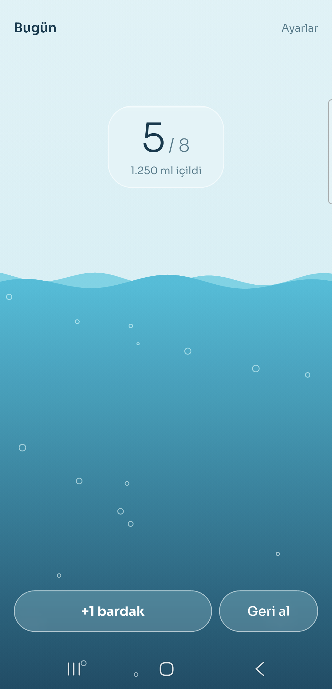
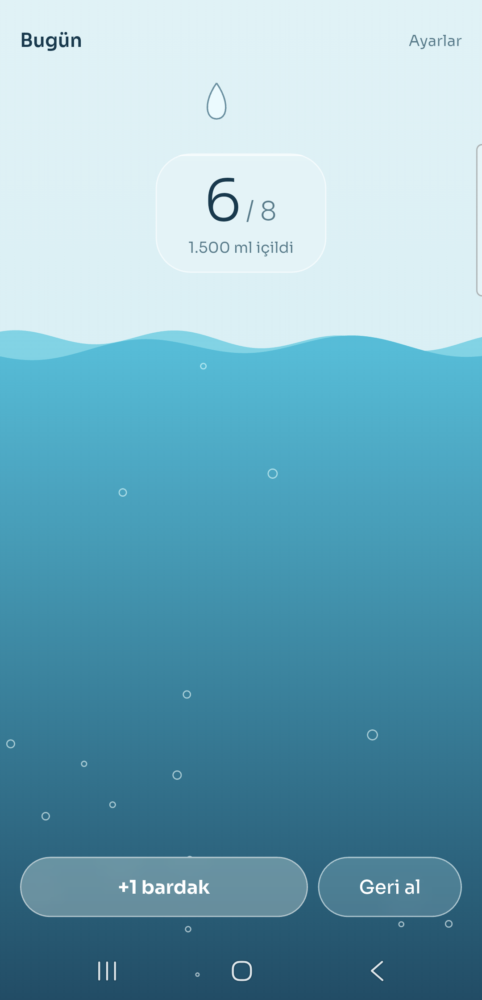
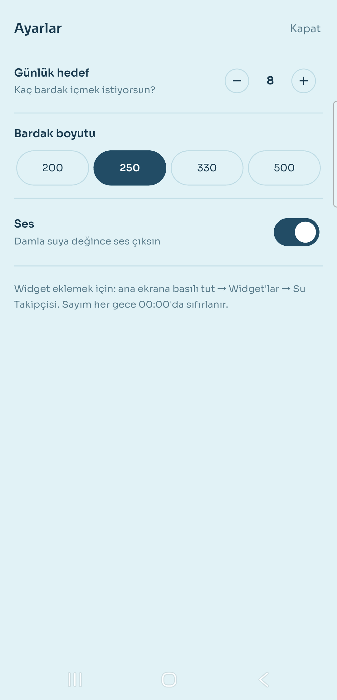
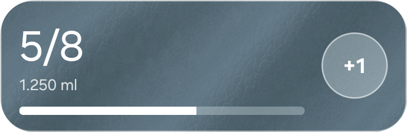

# Part 05 — Su Takipçisi

Gün içinde içilen suyu sayan Flutter uygulaması. Asıl işi ana ekrandaki
widget yapıyor: **"+1"e basınca uygulama açılmadan bir bardak eklenir.**
"Her hafta 1 uygulama" serisinin beşinci parçası.

**Gösterilen yetenek:** Android ana ekran widget'ı (Jetpack Glance) ve
Flutter ile Kotlin'in aynı veriyi paylaşması. Yanında seride ilk kez kendi
platform kanalımız (Flutter → Kotlin), bir GPU shader'ı ve ivmeölçer.

Uygulamanın **internet izni yoktur.** Sunucu, hesap, analiz yok; veri
telefonda, Android'in kendi yedeğine dahil (aşağıda).

## Çalıştırma

```bash
flutter pub get
flutter run
```

**Yalnız Android.** iOS'ta widget, Xcode ve WidgetKit gerektiriyor; bu
seri Windows'ta geliştirildiği için iOS widget'ı yok. Widget eklemek için:
ana ekrana basılı tut → Widget'lar → Su Takipçisi.

## Ekranlar

| Ekran | Ne yapar |
|---|---|
| Ana ekran | Ekranın kendisi bardak: su bugünkü orana göre yükselir. Sayı buzlu cam bir kutuda; "+1 bardak", "Geri al" |
| Ayarlar | Günlük hedef (1–20 bardak), bardak boyutu (200/250/330/500 ml), ses |
| Widget | Sayı, ml, doluluk çubuğu, "+1". Gövdeye dokunmak uygulamayı açar |






## Widget'taki "+1" neden Kotlin'de sayılıyor?

İlk sürüm `home_widget` paketinin arka plan geri çağrısını kullanıyordu:
widget'a dokununca paket arka planda bir Flutter motoru başlatıyor, Dart
kodu sayıyı artırıyordu. Kâğıt üstünde tek dil, tek mantık.

Telefonda **ara ara kayboldu.** Paketin iş kuyruğu
(`HomeWidgetBackgroundWorker`) motoru başlatıyor, Dart'ın bitmesini
**beklemeden** "tamamlandı" diyordu. Motorun açılması 1–3 saniye; Android
işlemi bu arada kapatınca "+1" sessizce gidiyordu.

Şimdi dokunuş doğrudan Kotlin'de işleniyor
([`SuWidget.kt`](android/app/src/main/kotlin/com/omergunes/su_takipcisi/SuWidget.kt)
→ `SuVerisi.ekle`): gün değiştiyse sıfırla, bir artır, diske yaz
(`commit`), widget'ı yeniden çiz. Flutter motoru hiç açılmıyor, sayı anında
değişiyor. Art arda hızlı dokunuşlar birbirinin üstüne yazmasın diye yazma
kilitli (`@Synchronized`).

Bedeli: "gün değiştiyse sayı sıfır" kuralı iki yerde duruyor — Dart'ta
[`GunlukDurum.bugunIcin`](lib/su/gunluk_durum.dart), Kotlin'de
`SuVerisi.bugunkuSayi`. İkisi de aynı anahtarları ve aynı tarih biçimini
kullanıyor:

| Anahtar | Tür | Yazan |
|---|---|---|
| `sayi` | Int | uygulama + widget |
| `tarih` | String, `yyyy-MM-dd` | uygulama + widget |
| `hedef`, `bardakMl` | Int | uygulama |
| `ses` | Boolean | uygulama (widget okumaz) |

Hepsi `home_widget`'ın tek SharedPreferences dosyasında. Ayrı veritabanı ya
da `shared_preferences` paketi yok.

## Su sahnesi

Hepsi [`lib/ui/su/`](lib/ui/su/) altında; hareket durumu çizimden ayrı,
saf Dart ([`su_fizigi.dart`](lib/ui/su/su_fizigi.dart)), bu yüzden testli.

| Parça | Nasıl |
|---|---|
| Dalga, kabarcık, damla, sıçrama | `CustomPainter` + `Ticker`; sabitler 60 fps'e göre yazıldı, `dt` ile çarpılıyor (90/120 Hz ekranda da aynı hız) |
| Buzlu cam | `BackdropFilter`; üç cam parçası `BackdropGroup` ile arka planı tek seferde okuyor |
| Telefon eğilince su eğilir | `sensors_plus` ivmeölçeri → [`egim.dart`](lib/ui/su/egim.dart); yalnız uygulama öndeyken açık |
| Dokununca halka | GPU shader ([`shaders/halka.frag`](shaders/halka.frag)) sahneyi mercek gibi büker; halka yokken kapalı |

Hareket azaltma ayarı açıksa (Android erişilebilirlik) dalga durur, damla
düşmez, su seviyesi doğrudan yerine oturur.

## Sesler

"+1"de hafif bir "vınn", damla suya değince "bloop". İkisi de ses dosyası
indirilmeden **matematikle üretildi**: kısa sürede tizleşen bir sinüs ve
üstel sönüm ([`tool/ses_uret.py`](tool/ses_uret.py)). Lisans derdi yok,
betik aynı dosyaları bire bir yeniden üretiyor.

Çalma Kotlin'de, Android'in `SoundPool`'u ile; Flutter kendi platform
kanalımızla "çal" diyor ([`lib/ses/ses.dart`](lib/ses/ses.dart) →
[`MainActivity.kt`](android/app/src/main/kotlin/com/omergunes/su_takipcisi/MainActivity.kt)).
Ses paketi eklenmedi: iki kısa ses için paket hem boyut hem izin getirebilir.
`SoundPool` sesi belleğe önceden yüklediği için ses, damlanın suya değdiği
kareyle aynı anda çıkıyor. Ayarlar → Ses ile kapanır.

## Veri ve yedek

Tutulan her şey yukarıdaki tablodaki beş değer: bugünün sayısı, tarihi,
hedef, bardak boyutu, ses ayarı. Geçmiş tutulmuyor.

`allowBackup` **açık**: telefon değişince hedef ve bardak ayarı kaybolmasın.
Yani veri "yalnız telefonda" değil; Android'in Google hesabına bağlı cihaz
yedeğine dahil. Veri hassas değil ve küçük olduğu için bilinçli seçim.

## İzinler ve dışa açık bileşenler

Kendi manifest'imiz hiç izin yazmıyor. Birleşmiş manifest'te dört izin
çıktı; hepsi WorkManager'dan (hem `home_widget` hem Glance kullanıyor):

| İzin | Karar | Neden |
|---|---|---|
| `WAKE_LOCK` | **kaldı** | Glance widget'ı WorkManager işiyle çiziyor; iş çalışırken kilit alınıyor |
| `ACCESS_NETWORK_STATE` | kaldırıldı | Ağ şartlı iş yok |
| `RECEIVE_BOOT_COMPLETED` | kaldırıldı | Yeniden başlatmada sürdürülecek iş yok |
| `FOREGROUND_SERVICE` | kaldırıldı | Ön plan servisi yok |

`ivmeölçer` için izin gerekmiyor; `sensors_plus` da izin eklemedi.

Dışa açık (`exported`) kendi bileşenimiz iki tane: başlatıcıdan açılan ana
ekran (her uygulamada böyle) ve widget alıcısı (sistem widget'ı güncellemek
için ona yayın gönderiyor). Kütüphanelerin açık bileşenleri — Glance'in
`GlanceRemoteViewsService`'i, WorkManager'ın `SystemJobService`'i, iki tanılama
alıcısı — hepsi sistem izniyle korumalı (`BIND_REMOTEVIEWS`,
`BIND_JOB_SERVICE`, `DUMP`); başka bir uygulama onlara erişemiyor.

İlk sürümde `HomeWidgetBackgroundReceiver` da açıktı ve korumasızdı: herhangi
bir uygulama "+1" yayını gönderebilirdi. Sayma Kotlin'e geçince bu alıcı
kaldırıldı.

Doğrulama, release derlemesinden sonra:

```bash
grep -o 'uses-permission android:name="[^"]*"' \
  build/app/intermediates/merged_manifest/release/processReleaseMainManifest/AndroidManifest.xml
```

Çıktıda `WAKE_LOCK` ve androidx'in kendi imza-seviyesi iç izni var.
Flutter'ın debug derlemesi hot reload için `INTERNET` ekler; release'de yok.

## Release için ProGuard notu

Widget'taki "+1" release'de **hiç çalışmadı**, debug'da çalışıyordu. Glance
eylem sınıfını (`ArtiBirEylemi`) çalışma anında adından bulup boş kurucusuyla
oluşturuyor; R8 kurucuyu kullanılmıyor sanıp silmişti
(`NoSuchMethodException: <init> []`). Çözüm
[`android/app/proguard-rules.pro`](android/app/proguard-rules.pro) içinde tek
`-keep` kuralı.

## Doğrulama

```bash
flutter analyze   # temiz
flutter test      # 25 test
```

Testler saf mantıkta: gece yarısı sıfırlama, geri alma sınırı, hedef ve
bardak kuralları, su fiziği (damla çarpınca tek halka ve sekiz parça,
60 ve 120 Hz'de aynı sonuç), eğim hesabı, suya dokunma kuralları.

Kotlin widget'ı, shader ve ses test edilmiyor (üçü de cihaza bağlı).
Gerçek telefonda elle doğrulandı: uygulama zorla durdurulmuşken tek ve art
arda beş "+1", uygulama ↔ widget eşzamanı, tarih ertesi güne alınınca
sıfırlama, eğim yönü, ses anahtarı.

## Paketler

`home_widget` · `sensors_plus`

Yazı tipi Sora, paket olarak değil dosya olarak gömülü
(`assets/fonts/`, OFL lisansı yanında). Tek değişken font dosyası tüm
kalınlıkları veriyor.

## Cihazda bulunanlar

| Sorun | Çözüm |
|---|---|
| Widget "+1" release'de çalışmıyor | R8 `-keep` kuralı (yukarıda) |
| Uygulama kapalıyken "+1" ara ara kayboluyor | Sayma Dart'tan Kotlin'e taşındı (yukarıda) |
| Ana ekran düzeni başlık boyuna büzülüyor | Sahne tam ekran bir kutuya alındı |
| Boşken "+1" düğmesinin beyaz yazısı açık zeminde okunmuyor | Su hiç içilmemişken de düğmeleri örtecek kadar yüksek |
| Düşen damla açık gökyüzünde seçilmiyor | Damla 1,5 kat büyüdü, ince koyu çerçeve aldı |

## Bilinen sınırlar

- Widget'ın yeniden çizilmesi bazen 15–30 saniye sürebiliyor.
- Uygulama açılmazsa widget gece yarısından sonra en geç 30 dakikada 0'a
  döner (Android'in izin verdiği en kısa yenileme aralığı). İlk "+1" her
  durumda doğru güne yazılır.
- iOS widget'ı yok (yukarıda).

## Kurulum notu

Depoyu klonladıysan commit koruması için bir kez:

```bash
git config core.hooksPath .githooks
```
