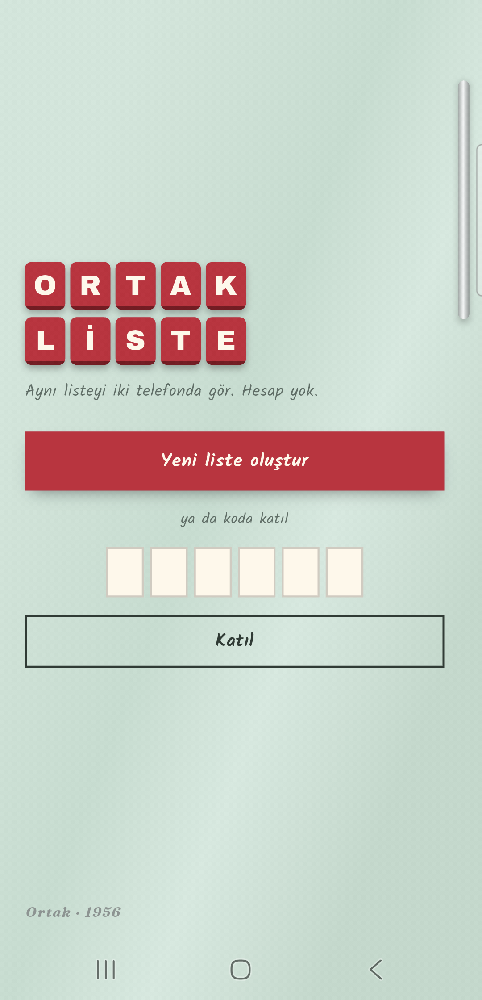

# Part 06 — Ortak Liste

İki telefonda aynı anda güncellenen alışveriş listesi. Biri "süt" yazar,
öbürünün ekranına not olarak düşer. Hesap yok: listeyi açan kişi 6 haneli
bir kod görür, öbürü o kodu yazıp katılır.
"Her hafta 1 uygulama" serisinin altıncı parçası.

**Gösterilen yetenek:** Firebase — anonim giriş, Firestore'da gerçek zamanlı
veri ve **güvenlik kuralları**. Kurallar emülatörde 21 testle kanıtlanıyor.

Serinin **ilk internetli uygulaması.** Liste Google'ın sunucusunda (Firestore,
`europe-west3`) duruyor; listenin üyeleri görebilir. Ad, e-posta, telefon
numarası tutulmuyor.

## Çalıştırma

Depoda benim Firebase projemin ayar dosyaları **yok**. Kendi projeni bağlaman gerekiyor:

1. [Firebase konsolunda](https://console.firebase.google.com) ücretsiz (Spark) bir proje aç.
   Authentication → **Anonymous**'u aç. Firestore → veritabanı oluştur (üretim modu).
2. Projeyi bağla ve kuralları yükle:

```bash
dart pub global activate flutterfire_cli
flutterfire configure --platforms=android     # firebase_options.dart + google-services.json üretir
npm install -g firebase-tools && firebase login
cp .firebaserc.ornek .firebaserc              # içine kendi proje kimliğini yaz
firebase deploy --only firestore:rules
flutter run
```

Kurallar yüklenmeden uygulama liste açamaz: üretim modundaki Firestore her
isteği reddeder. **Yalnız Android** (seri Windows'ta geliştiriliyor).

## Ekranlar

| Ekran | Ne yapar |
|---|---|
| Başla | "Yeni liste oluştur" ya da 6 haneli kodla katıl |
| Liste | Notlar buzdolabı kapısında. Dokun: alındı (not solar, üstü çizilir, alta iner). Basılı tut: sil. Koda dokun: kopyala. ⋯ menüsü: listeden ayrıl |

Notun sağ altındaki işaret ekleyeni gösteriyor: **dolu nokta = sen, boş
halka = öbür üye.** Renk değil şekil, çünkü uygulama isim tutmuyor.




## Güvenlik: anahtar gizli değil, koruma kurallarda

`firebase_options.dart` içindeki `apiKey` **gizli bir şey değil.** APK'yı açan
herkes görür; Firebase'in kendisi de böyle tasarlanmış. O anahtarı bilen biri
veritabanıma doğrudan istek atabilir. Onu durduran tek şey
[`firestore.rules`](firestore.rules).

Kural yazılmadıysa veritabanı ya herkese açıktır ya kimseye. Bu yüzden her
iddia bir testle kanıtlanıyor ([`kural-testi/kurallar.test.mjs`](kural-testi/kurallar.test.mjs)):

| İddia | Test |
|---|---|
| Yabancı bir listeyi okuyamaz | 2 |
| Giriş yapmamış kimse hiçbir şeyi okuyamaz | 3 |
| Kodlar taranamaz (tek tek sorulabilir, listelenemez) | 4 |
| **Liste kimliğini bilen ama kodu bilmeyen katılamaz** | 6 |
| Kimse başkasını üye ekleyemez, katılırken başka alana dokunamaz | 7, 8 |
| Var olan bir kodun üzerine yazılamaz | 9 |
| Üye olmayan ürün okuyamaz, yazamaz | 10 |
| Başkası adına ürün eklenemez | 11 |
| Ürün adı 1–60 karakter, sonradan değiştirilemez | 12, 13 |
| Bir listede en fazla 10 kişi | 14 |
| Üye yalnız kendini çıkarabilir, liste silinemez | 15 |

### Kod nasıl kanıtlanıyor?

Katılma tek toplu yazma: kendini `uyeler`'e eklersin **ve** aynı anda
`katilimlar/{senin kimliğin}` belgesine kodu yazarsın. Kural iki şeye bakıyor:
o belgedeki kod listenin kodu mu, ve liste güncellemesi bu belgeyle birlikte mi
geliyor (`getAfter`). Liste kimliği bir yolla sızsa bile kodu bilmeyen katılamaz.

Kod çakışmasını da kural yakalıyor: `kodlar/{kod}` yalnız bir kez
oluşturulabiliyor. Aynı kod zaten varsa yazma reddediliyor, uygulama yeni kodla
tekrar deniyor. Kod alfabesinde birbirine karışan karakterler yok (0/O, 1/I/L):
31 karakter × 6 hane ≈ 887 milyon ihtimal.

### Kural testlerini çalıştırma

Emülatör Java istiyor (Android Studio'nunki yetiyor):

```bash
cd kural-testi && npm install && cd ..
firebase emulators:exec --only firestore "npm --prefix kural-testi test"
```

## Veri ve yedek

Tutulan her şey: ürün adı, alındı işareti, ekleyenin anonim kimliği, liste kodu.
Telefonda yalnız Firestore'un önbelleği ve anonim oturum var.

`allowBackup` **kapalı.** Asıl veri zaten bulutta; önbelleği ve oturumu
yedeklemenin faydası yok. Bedeli: telefon değişince listeye kodla yeniden
katılmak gerekiyor.

## İzinler ve dışa açık bileşenler

| İzin | Karar | Neden |
|---|---|---|
| `INTERNET` | **kaldı** | Firestore |
| `ACCESS_NETWORK_STATE` | **kaldı** | Önce kaldırdım, uygulama açılışta çöktü. Firestore bağlantıyı `ConnectivityManager` ile izliyor. Yalnız "internet var mı" bilgisini okur |
| `READ_GSERVICES` | kaldırıldı | Play Services bağımlılığından geliyor, anonim girişte gerekmiyor |

Firebase Auth, Google ve telefonla giriş için dışarıdan açılabilen iki ekran
getiriyor (`GenericIdpActivity`, `RecaptchaActivity`). Anonim girişte ikisi de
kullanılmıyor; kaldırıldı. Dışa açık tek ekran uygulamanın kendisi. Kalan iki
kütüphane bileşeni izinle korumalı (`REVOCATION_NOTIFICATION`, `DUMP`).

Doğrulama, release derlemesinden sonra:

```bash
aapt dump permissions build/app/outputs/flutter-apk/app-release.apk
```

Analytics ve Crashlytics yok: paketleri eklenmedi, APK'da izleri yok.

## Doğrulama

```bash
flutter analyze   # temiz
flutter test      # 19 test
```

Dart testleri saf mantıkta: kod üretme ve alfabesi, Türkçe baş harf
(`incir` → `İ`; Dart'ın `toUpperCase()`'i `I` veriyor), ürün sıralama ve ad
temizleme, not açısı.

Gerçek cihazda (telefon + emülatör) elle doğrulandı: oluştur, kodla katıl,
iki yönlü anlık ekleme / işaretleme / silme, uçak modunda ekleyip bağlantı
gelince eşitleme.

## Paketler

`firebase_core` · `firebase_auth` · `cloud_firestore`

Riverpod yok: Firestore zaten akış veriyor, `StreamBuilder` yetiyor.
Yazı tipleri (Kalam, Archivo Black, Fraunces) dosya olarak gömülü
(`assets/fonts/`, OFL lisansları yanında) — `google_fonts` hem dördüncü paket
olurdu hem çalışırken ağdan font çekerdi.

## Cihazda bulunanlar

| Sorun | Çözüm |
|---|---|
| `ACCESS_NETWORK_STATE` kaldırılınca açılışta çöküş | İzin geri kondu (yukarıda) |
| Yeni liste açılınca "Liste yüklenemedi" | Firestore yeni listeyi sunucu onaylamadan ekrana veriyordu; ekran ürünleri dinlemeye başlayınca kural reddediyordu. Onaylanmamış liste artık "yok" sayılıyor |
| Gezinme çubuğu siyah şerit | Kenardan kenara çizim |

## Bilinen sınırlar

- **Kaba kuvvet tam engellenmiyor.** Kodu tahmin etmeye çalışan biri Firebase'in
  genel istek sınırına takılır, ama buna özel bir koruma (App Check) yok.
- Liste silinmiyor; son üye ayrılınca liste Firestore'da kalır.
- Tek liste. Birden çok liste, bildirim, paylaşım linki yok.
- iOS derlemesi yok.

## Kurulum notu

Depoyu klonladıysan commit koruması için bir kez:

```bash
git config core.hooksPath .githooks
```
