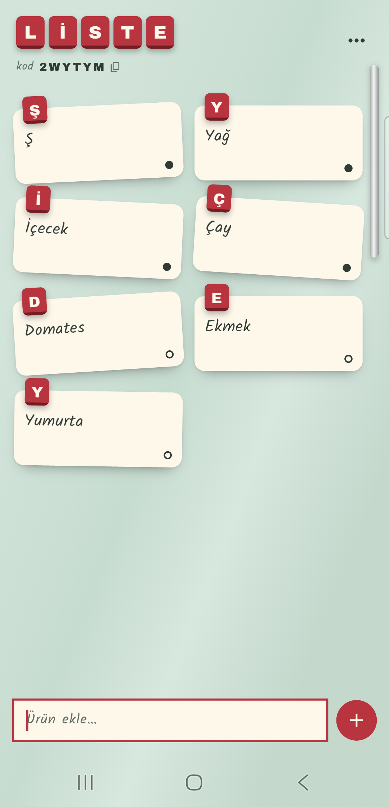
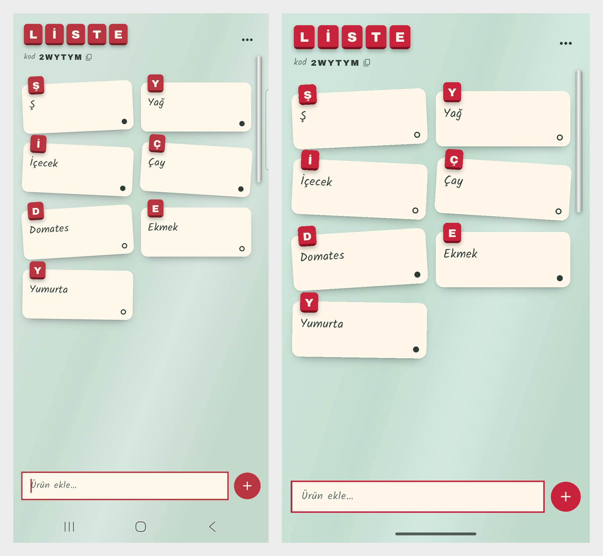

# Ortak Liste
### Part 06 · Her Hafta 1 Uygulama

Aynı evde yaşayan iki kişi için, "markete giden ne alacağını bilmiyor, liste
öbürünün telefonunda" problemini çözen bir Android uygulaması. Bir telefonda
yazılan ürün, öbüründe anında not olarak beliriyor.

**Kod:** [github.com/MRGNSs11/weekly-flutter-apps-1](https://github.com/MRGNSs11/weekly-flutter-apps-1/tree/main/part06-ortak-liste) · **Yığın:** Flutter, Firebase Auth (anonim), Cloud Firestore, güvenlik kuralları

---

## 01 — Ne yaptım

Liste bir buzdolabı kapısı. Her ürün krem bir not, tepesinde ürünün baş harfi
bir karo mıknatıs. Hesap açmak yok: listeyi açan 6 haneli bir kod görüyor,
öbürü o kodu yazıp katılıyor. Birinin eklediği not öbürünün ekranına yukarıdan
düşüyor. Alınan not soluyor, üstü çiziliyor, alta iniyor. İnternet yokken de
ekleniyor, bağlantı gelince eşitleniyor.

## 02 — Neyi YAPMADIM

- Google ile giriş (anonim giriş yetiyor, kurulumu yarım gün yerdi)
- Birden çok liste
- Paylaşım linki ya da QR ile katılma
- Bildirim

Uygulamanın tek işi iki telefonu aynı listede tutmak. Gerisi bu işi kanıtlamaktan
vakit çalardı.

## 03 — Bu hafta gösterdiğim teknik yetenek

**Firebase: anonim giriş, Firestore'da gerçek zamanlı veri ve güvenlik
kuralları.** Seride ilk kez bulut ve ilk kez birden çok kullanıcı var.
Firebase'e dokunan tek dosya
[`liste_deposu.dart`](lib/liste/liste_deposu.dart), veritabanını koruyan tek
dosya [`firestore.rules`](firestore.rules). Kuralları emülatörde (bilgisayarda
çalışan sahte Firestore) 21 testle sınadım.

## 04 — Aldığım karar

**Neden Google ile giriş değil de anonim giriş ve kod?**

Google ile giriş daha "gerçek" görünüyordu. Telefon değişince hesap kalır,
kimin kim olduğu bellidir. Ama bunun için dördüncü bir paket, imza parmak izi
ve Google Cloud ayarı gerekiyordu. Kurulum tek başına yarım gün alırdı.

Asıl soru şuydu: bu uygulamada kimin kim olduğunu bilmem gerekiyor mu?
Gerekmiyor. İki kişinin aynı listeyi görmesi yetiyor. Anonim giriş her
telefona sessizce bir kimlik veriyor, kullanıcı hiçbir şey doldurmuyor.
Listeye katılmak için 6 haneli kod yetiyor.

Bedeli, uygulama silinince kimliğin de gitmesi. Listeye kodla yeniden
katılmak gerekiyor. Karşılığında uygulama ilk açılışta hiçbir şey sormadan
çalışıyor ve isim, e-posta tutmuyor.

## 05 — Nasıl doğruladım

21 kural testi ve 19 birim testi. Kural testleri README'deki her güvenlik
cümlesine karşılık geliyor. Birim testleri saf mantıkta: kod üretme, Türkçe
baş harf, sıralama.

Sonra iki cihazda denedim: telefon ve emülatör. Oluştur, kodla katıl, iki
yönlü ekle, işaretle, sil, uçak modunda ekleyip bağlantı gelince eşitle. İki
hatayı yalnız telefon gösterdi. Ağ durumu iznini kaldırınca uygulama açılışta
çöktü. Yeni liste sunucu onaylamadan ekrana düştüğü için ürünler kurala
takıldı.

## 06 — Ne öğrendim

"Gereksiz izni kaldırdım" demek için önce kaldırıp denemek gerekiyor.
`ACCESS_NETWORK_STATE`'i kaldırdım, uygulama açılmadı. İzin geri geldi,
gerekçesi manifest'e yazıldı. Bir iddiayı cihazda doğrulamadan yazmamak,
bu seride yine işe yaradı.

Bir de: Firestore yeni bir kaydı sunucu onaylamadan ekrana veriyor. Uygulama
hızlı görünsün diye güzel bir özellik. Ama o kayda bağlı ikinci bir istek,
sunucuda kayıt henüz yokken gidince reddediliyor. Yeni listeyi ancak sunucu
onaylayınca "var" saymak gerekti.

---
Bu, her hafta bir mobil uygulama bitirdiğim serinin 6. uygulaması.
Diğerleri: [github.com/MRGNSs11/weekly-flutter-apps-1](https://github.com/MRGNSs11/weekly-flutter-apps-1)
