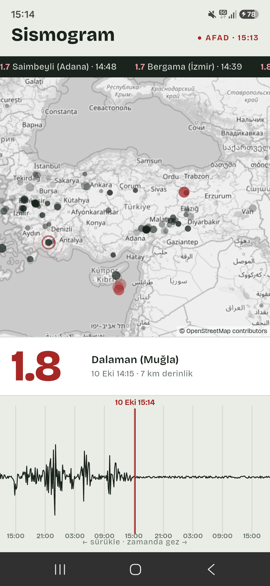
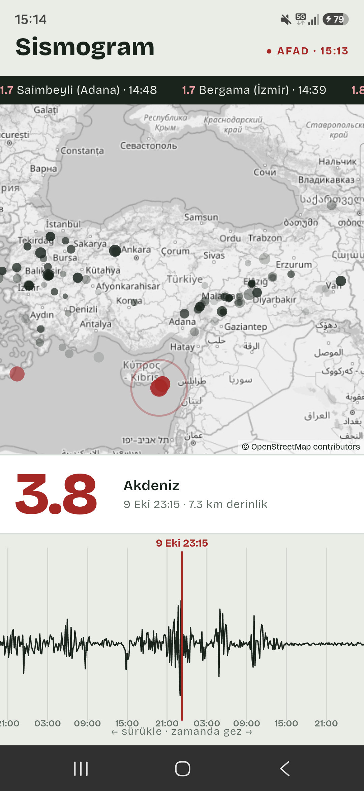

# Deprem Haritası
### Part 07 · Her Hafta 1 Uygulama

Türkiye'de yaşayan biri için "az önce sallandı, nerede ve kaç büyüklükte?"
sorusunu tek bakışta cevaplayan bir Android uygulaması. Son 7 günün
depremleri bir sismograf kâğıdında tepe olarak duruyor; kâğıdı geri çekince
harita o saate dönüyor.

**Kod:** [github.com/MRGNSs11/weekly-flutter-apps-1](https://github.com/MRGNSs11/weekly-flutter-apps-1/tree/main/part07-deprem-haritasi) · **Yığın:** Flutter, flutter_map + OpenStreetMap, AFAD açık verisi, CustomPainter

---

## 01 — Ne yaptım

Tek ekran. Üstte son depremlerin kayan bandı, ortada harita, altta sismograf
kâğıdı. Kâğıdın ortasındaki kırmızı çizgi bir anı gösteriyor. Harita o anın
son 24 saatini çiziyor: eski depremler soluyor, 3 ve üstü kırmızı. Çizginin
yakınındaki en büyük deprem büyük puntoyla yazıyor. Kâğıdı parmakla sürükleyip
7 gün geriye gidilebiliyor. Haritadaki bir noktaya dokununca kâğıt o depremin
anına atlıyor.

## 02 — Neyi YAPMADIM

- Filtre ve ayrı liste ekranı
- Konum izni, "yakınımdaki depremler"
- Bildirim, arka planda takip
- İkinci veri kaynağı (Kandilli, USGS)

Uygulamanın tek fikri veriyi tabloya değil, insanların zaten tanıdığı bir
görüntüye çevirmek. Liste ekranı bu fikri sulandırırdı.

## 03 — Bu hafta gösterdiğim teknik yetenek

**Harita, canlı veri ve veriden çizilen sürüklenebilir bir sinyal.** Seride
ilk kez harita ve ilk kez zamanda gezinme var. Dalga
[`sismogram.dart`](lib/deprem/sismogram.dart)'ta saf Dart ile hesaplanıyor:
her deprem, büyüklüğünün 2,15'inci kuvvetiyle orantılı, 17 dakikada sönen bir
tepe bırakıyor. Dalganın yönü piksel zamanından türetiliyor, böylece kâğıt
kayınca dalga titremiyor. Hesap 11 testle sınanıyor.

## 04 — Aldığım karar

**Neden Google Maps değil, flutter_map + OpenStreetMap?**

Google Maps Flutter'da en bilinen yol. Ama anahtar ve faturalandırma hesabı
istiyor. Açık kaynak bir depoda anahtar yönetmek, tek ekranlık bir harita için
fazla yük.

flutter_map açık kaynak ve harita parçalarını (karo) anahtarsız alıyor. İki karo sağlayıcısını
daha denedim: CARTO artık anahtar istiyor, Esri'nin lisansı hesapsız kullanımı
açıkça kapsamıyor. OpenStreetMap'in kuralı ise açık: uygulama kendini tanıtacak,
atıf ekranda görünecek, karolar önbelleğe alınacak. Üçünü de uyguladım.

Bedeli: harita etiketleri yerel dilde. Komşu ülkelerde Rusça, Arapça yer
adları görünüyor. Gri tonla bu göze batmıyor.

## 05 — Nasıl doğruladım

42 birim testi: sismogram hesabı, AFAD istemcisi (sahte sunucuyla), tarih
çevirisi, yer adı kısaltma. AFAD'ın saatlerinin UTC olduğunu aynı depremleri
USGS kayıtlarıyla karşılaştırarak doğruladım.

Sonra gerçek telefonda ölçtüm. Emülatörde bir kare 20 ms sürüyordu, akıcılık
sınırının (16,7 ms) üstünde. Telefonda sürüklerken ortalama 3,8 ms çıktı.
394 karenin yalnız 2'si sınırı az aştı.

## 06 — Ne öğrendim

**API'nin belgesine değil davranışına bak.** AFAD servisinde `limit`
parametresi sonuçları sıralamadan önce kesiyor. "Son 100 deprem" istediğimde
en yeniler gelmiyordu. 7 günün tamamını çekip sıralamayı uygulamada yapmak
çözdü; zaten yalnız 220 KB.

---
Bu, her hafta bir mobil uygulama bitirdiğim serinin 7. uygulaması.
Diğerleri: [github.com/MRGNSs11/weekly-flutter-apps-1](https://github.com/MRGNSs11/weekly-flutter-apps-1)
